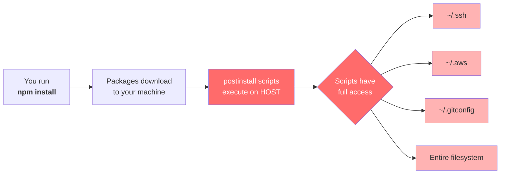
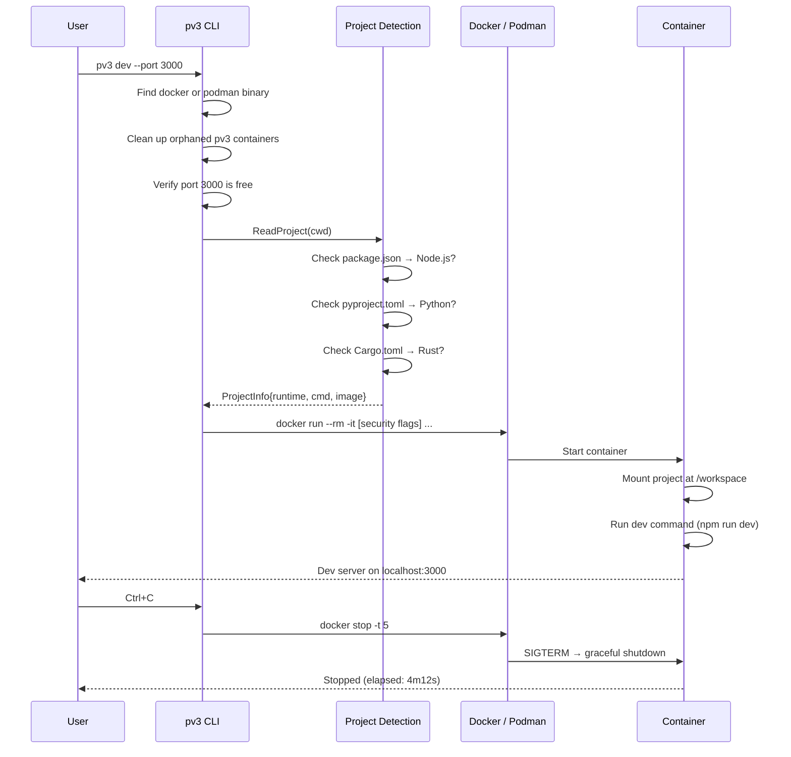
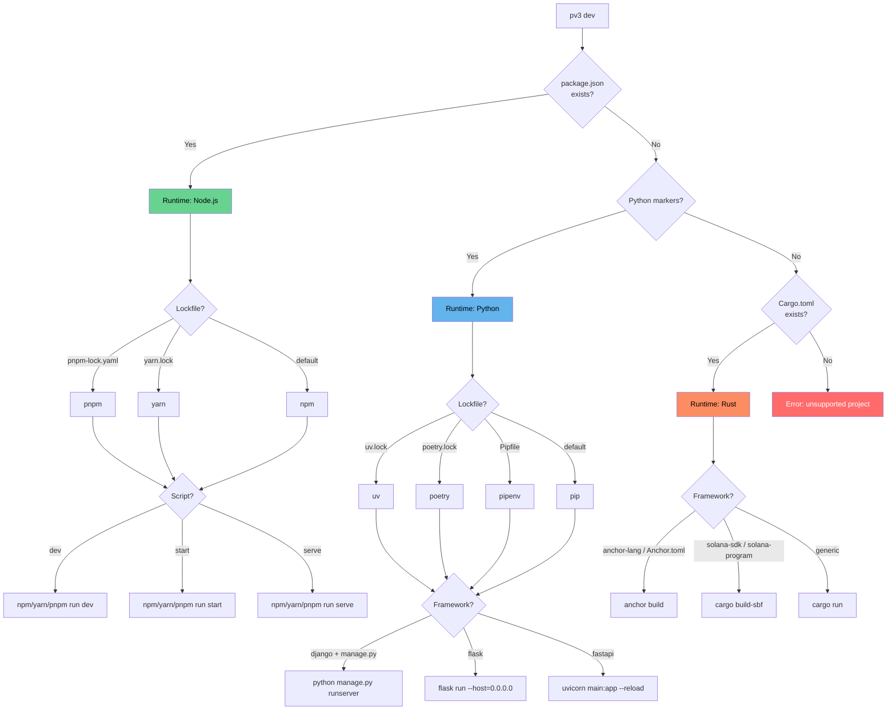
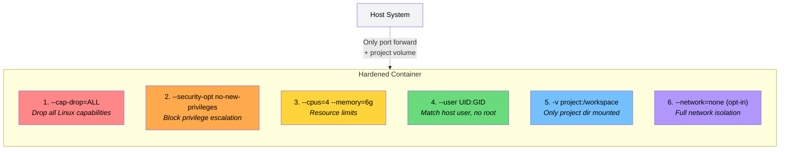
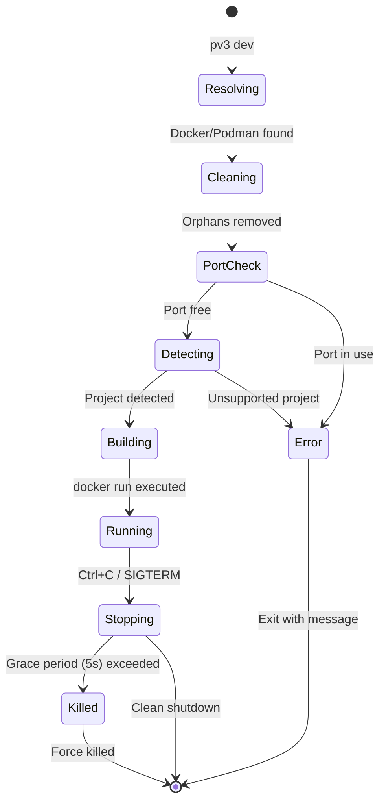

# pv3

**Run your dev server in an isolated Docker container.** Same logs, same localhost URLs — rogue dependencies can't touch your host system.

pv3 auto-detects your project type, picks the right runtime image, and launches a hardened container with a single command. No Dockerfiles. No config. Just `pv3 dev`.

---

## Why pv3?

Every time you run `npm install`, `pip install`, or `cargo build`, you execute code written by strangers on your machine — postinstall scripts, build.rs files, setup.py hooks — all with full access to your home directory, SSH keys, and credentials.

### Traditional development flow



### Development flow with pv3

```mermaid
flowchart LR
    A[You run<br><b>pv3 dev</b>] --> B[pv3 detects<br>project type]
    B --> C[Launches hardened<br>Docker container]
    C --> D[Packages install<br>INSIDE container]
    D --> E[Scripts execute<br>in sandbox]
    E --> F{Container<br>can only see}
    F --> G[/workspace<br>your project]
    F --> H[Mapped port<br>localhost:5173]

    style C fill:#51cf66,color:#fff
    style E fill:#51cf66,color:#fff
    style G fill:#b2f2bb
    style H fill:#b2f2bb
```

Your project works exactly the same — same dev server, same hot reload, same browser URL — but nothing can reach beyond the container.

---

## Quick start

```sh
curl -fsSL https://pv3.dev | sh
```

Or build from source:

```sh
git clone https://github.com/pv3dev/pv3.git
cd pv3
make install
```

Then run it in any supported project:

```sh
cd your-project
pv3 dev
```

---

## Usage

```sh
pv3 dev                        # auto-detect and run dev script
pv3 dev --port 3000            # use port 3000 instead of 5173
pv3 dev --no-net               # fully offline, no network access
pv3 dev --image node:20-slim   # override the default image
pv3 dev --verbose              # show the full docker run command
```

### CLI reference

| Flag | Type | Default | Description |
|------|------|---------|-------------|
| `--port` | int | `5173` | Host port to forward into the container |
| `--no-net` | bool | `false` | Disable all network access inside the container |
| `--image` | string | auto-detected | Override the container image (e.g. `node:20-slim`) |
| `--verbose` | bool | `false` | Print the full `docker run` command before executing |
| `--version` | | | Print the pv3 version |
| `--help` | | | Show help |

---

## How it works



### Step by step

1. **Runtime resolution** — finds `docker` or `podman` in your PATH and verifies the daemon is running
2. **Orphan cleanup** — removes any leftover `pv3-dev-*` containers from crashed sessions
3. **Port check** — binds to the port to confirm it's free before starting
4. **Project detection** — reads manifest files to determine runtime, package manager, dev command, and Docker image
5. **Container launch** — builds `docker run` arguments with security hardening and starts the container
6. **Signal forwarding** — traps SIGINT/SIGTERM/SIGHUP and forwards them to the container for clean shutdown
7. **Cleanup** — stops the container with a 5-second grace period, then kills if needed

---

## Project detection

pv3 reads your project files and automatically determines everything needed to run your dev server.



### Node.js

| Detection | Details |
|-----------|---------|
| **Marker** | `package.json` |
| **Script priority** | `dev` > `start` > `serve` |
| **Package managers** | npm (default), yarn (`yarn.lock`), pnpm (`pnpm-lock.yaml`) |
| **Run command** | `{pm} run {script}` |
| **Default image** | `node:22-bookworm-slim` |

Supported frameworks: Vite, Next.js, Nuxt, Express, Vue CLI, and any project with a `dev`, `start`, or `serve` script.

### Python

| Detection | Details |
|-----------|---------|
| **Markers** | `pyproject.toml`, `requirements.txt`, `setup.py`, or `Pipfile` |
| **Script priority** | `[project.scripts]` keys: `dev` > `serve` > `start` > `run` |
| **Package managers** | pip (default), uv (`uv.lock`), poetry (`poetry.lock`), pipenv (`Pipfile`) |
| **Default image** | `python:3.12-slim` |

| Framework | Detected by | Dev command |
|-----------|------------|-------------|
| Django | `django` dependency + `manage.py` | `python manage.py runserver 0.0.0.0:8000` |
| Flask | `flask` dependency | `flask run --host=0.0.0.0 --port=5000` |
| FastAPI | `fastapi` dependency | `uvicorn main:app --host 0.0.0.0 --port 8000 --reload` |

### Rust

| Detection | Details |
|-----------|---------|
| **Marker** | `Cargo.toml` |
| **Package manager** | cargo |
| **Default run command** | `cargo run` |
| **Default image** | `rust:1.85-slim` |

| Framework | Detected by | Script name |
|-----------|------------|-------------|
| Solana Anchor | `anchor-lang` dependency or `Anchor.toml` | `anchor build` |
| Solana Native | `solana-sdk` or `solana-program` dependency | `cargo build-sbf` |
| Generic Rust | Valid `[package]` in Cargo.toml | `cargo run` |

Rust projects benefit the most from pv3's isolation — Cargo build scripts (`build.rs`) in any dependency execute arbitrary code at compile time. A single malicious crate can read your filesystem, exfiltrate secrets, or install backdoors. pv3 sandboxes the entire build process.

---

## Security model

pv3 applies six layers of container hardening by default. No configuration needed.



| Layer | Flag | What it does |
|-------|------|-------------|
| Capability drop | `--cap-drop=ALL` | Removes all Linux capabilities — the container cannot access raw sockets, change file ownership, load kernel modules, or perform any privileged operation |
| Privilege lock | `--security-opt no-new-privileges:true` | Prevents processes from gaining privileges via SUID/SGID binaries |
| Resource limits | `--cpus=4 --memory=6g` | Caps CPU and memory to prevent fork bombs, crypto miners, or runaway processes |
| User mapping | `--user UID:GID` | Runs as your host user — no root inside the container, file ownership preserved |
| Volume isolation | `-v project:/workspace:delegated` | Only your project directory is visible — no access to `~/.ssh`, `~/.aws`, `~/.gitconfig`, or any other host files |
| Network isolation | `--network=none` | Opt-in with `--no-net` — completely cuts network access so build scripts can't phone home |

### What a malicious dependency CANNOT do inside pv3

- Read your SSH keys or AWS credentials
- Access your browser cookies or password stores
- Exfiltrate data to a remote server (with `--no-net`)
- Escalate to root
- Escape the container
- Consume all system resources

---

## Environment handling

| Feature | Behavior |
|---------|----------|
| `.env` file | Automatically passed via `--env-file` if present in project root |
| `NODE_ENV` | Set to `development` for all Node.js projects |
| `TERM` | Host terminal type forwarded for proper color output |
| Working directory | Set to `/workspace` inside the container |

---

## Container lifecycle



Container naming format: `pv3-dev-{project-name}-{random-8-chars}`

Example: `pv3-dev-my-saas-app-k7x2m9f1`

---

## Requirements

- [Docker](https://docs.docker.com/get-docker/) or [Podman](https://podman.io/)

pv3 checks for both and uses whichever is available. Podman is preferred if both are installed.

---

## Installation

### One-line install (macOS / Linux)

```sh
curl -fsSL https://pv3.dev | sh
```

Downloads the latest release binary for your platform and installs it to `/usr/local/bin`.

### Build from source

```sh
git clone https://github.com/pv3dev/pv3.git
cd pv3
make install
```

### Supported platforms

| OS | Architecture | Binary |
|----|-------------|--------|
| macOS | ARM64 (Apple Silicon) | `pv3-darwin-arm64` |
| macOS | AMD64 (Intel) | `pv3-darwin-amd64` |
| Linux | ARM64 | `pv3-linux-arm64` |
| Linux | AMD64 | `pv3-linux-amd64` |

---

## Development

```sh
make build          # build for current platform
make install        # install to $GOPATH/bin
make release        # cross-compile for all platforms
make clean          # remove build artifacts
go test ./... -v    # run all tests
go vet ./...        # static analysis
```

### Project structure

```
main.go                              # entry point, version injection
Makefile                             # build, install, release targets
install.sh                           # curl installer script
internal/
  dev/
    dev.go                           # CLI commands and flags (Cobra)
    dev_test.go                      # flag parsing and default tests
  docker/
    docker.go                        # container orchestration, security, signals
    docker_test.go                   # docker args, port check, naming tests
  project/
    project.go                       # detection dispatcher, Node.js reader
    project_test.go                  # integration tests across all runtimes
    python.go                        # Python detection, TOML parsing
    python_test.go                   # Python framework and pkg manager tests
    rust.go                          # Rust/Solana detection, Cargo parsing
    rust_test.go                     # Rust framework and dependency tests
testdata/
  javascript/                        # Node.js test fixtures
    vite-react/                      # Vite + React (npm)
    nextjs-yarn/                     # Next.js (yarn)
    nuxt-pnpm/                       # Nuxt (pnpm)
    express-start/                   # Express (start script)
    vue-serve/                       # Vue CLI (serve script)
    env-file/                        # project with .env
    no-dev-script/                   # error case
    invalid-json/                    # error case
  python/                            # Python test fixtures
    python-django/                   # Django + pyproject.toml
    python-flask/                    # Flask + requirements.txt
    python-fastapi/                  # FastAPI + pyproject.toml
    python-poetry/                   # Poetry managed
    python-uv/                       # uv managed
    python-pyproject-scripts/        # custom scripts
    python-no-dev/                   # error case
  rust/                              # Rust test fixtures
    solana-anchor/                   # Anchor framework
    solana-native/                   # Native Solana
    rust-generic/                    # Basic Rust project
    rust-no-dev/                     # error case
  go/
    go-project/                      # unsupported runtime (negative test)
```

### Dependencies

pv3 has minimal dependencies by design:

```
github.com/spf13/cobra    # CLI framework
github.com/spf13/pflag    # POSIX flag parsing
```

No TOML libraries, no Docker SDKs, no HTTP clients. Project detection uses lightweight line-based parsers. Docker interaction uses direct exec of the `docker`/`podman` binary.

---

## License

[MIT](LICENSE)
