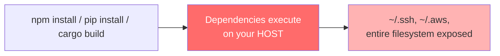
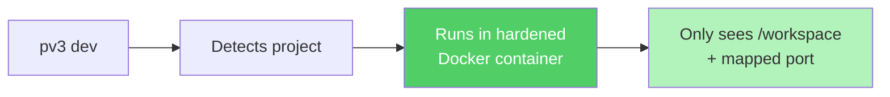
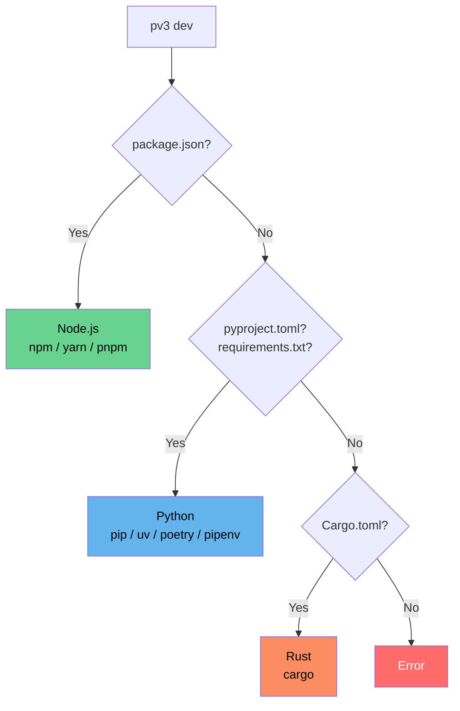

# pv3

**Run your dev server in an isolated Docker container.** Same logs, same localhost URLs — rogue dependencies can't touch your host system.

No Dockerfiles. No config. Just `pv3 dev`.

---

## The problem

Every `npm install`, `pip install`, or `cargo build` executes code from strangers on your machine — with full access to your home directory, SSH keys, and credentials.



**With pv3**, everything runs inside a sandboxed container. Same dev experience, nothing escapes.



---

## Quick start

```sh
curl -fsSL https://pv3.dev | sh
```

```sh
cd your-project
pv3 dev
```

Or build from source: `git clone https://github.com/pv3dev/pv3.git && cd pv3 && make install`

---

## Usage

```sh
pv3 dev                        # auto-detect and run
pv3 dev --port 3000            # different port
pv3 dev --no-net               # no network access
pv3 dev --image node:20-slim   # override image
pv3 dev --verbose              # print docker command
```

| Flag | Default | Description |
|------|---------|-------------|
| `--port` | `5173` | Host port to forward |
| `--no-net` | `false` | Disable network access |
| `--image` | auto | Override container image |
| `--verbose` | `false` | Print `docker run` command |

---

## Project detection



### Node.js

Detects `package.json`, resolves `dev` > `start` > `serve` scripts, picks package manager from lockfiles.

| Package manager | Detected by | Default image |
|----------------|-------------|---------------|
| npm | default | `node:22-bookworm-slim` |
| yarn | `yarn.lock` | `node:22-bookworm-slim` |
| pnpm | `pnpm-lock.yaml` | `node:22-bookworm-slim` |

### Python

Detects `pyproject.toml`, `requirements.txt`, `setup.py`, or `Pipfile`. Package manager from lockfiles.

| Framework | Detected by | Dev command |
|-----------|------------|-------------|
| Django | `django` dep + `manage.py` | `python manage.py runserver 0.0.0.0:8000` |
| Flask | `flask` dep | `flask run --host=0.0.0.0 --port=5000` |
| FastAPI | `fastapi` dep | `uvicorn main:app --host 0.0.0.0 --port 8000 --reload` |

Package managers: pip (default), uv, poetry, pipenv. Default image: `python:3.12-slim`.

### Rust

Detects `Cargo.toml`. Focused on Solana and crypto development where build-time isolation matters most.

| Framework | Detected by | Script name |
|-----------|------------|-------------|
| Solana Anchor | `anchor-lang` dep or `Anchor.toml` | `anchor build` |
| Solana Native | `solana-sdk` or `solana-program` dep | `cargo build-sbf` |
| Generic | Valid `[package]` in Cargo.toml | `cargo run` |

Default image: `rust:1.85-slim`. All Rust projects use `cargo run` as the container command.

---

## Security

Six layers of hardening applied by default:

| Layer | Flag | Purpose |
|-------|------|---------|
| Capability drop | `--cap-drop=ALL` | No privileged operations |
| Privilege lock | `--security-opt no-new-privileges` | No SUID escalation |
| Resource limits | `--cpus=4 --memory=6g` | Prevents fork bombs and miners |
| User mapping | `--user UID:GID` | No root, matches host user |
| Volume isolation | `-v project:/workspace` | Only project dir visible |
| Network isolation | `--network=none` | Opt-in via `--no-net` |

`.env` files are passed through automatically. `TERM` is forwarded for color output.

---

## Requirements

[Docker](https://docs.docker.com/get-docker/) or [Podman](https://podman.io/). pv3 finds whichever is available.

Platforms: macOS (ARM64, AMD64), Linux (ARM64, AMD64).

---

## Development

```sh
make build          # build for current platform
make release        # cross-compile all platforms
go test ./... -v    # run tests
go vet ./...        # static analysis
```

### Structure

```
main.go                       # entry point
internal/
  dev/                        # CLI commands (Cobra)
  docker/                     # container orchestration
  project/                    # detection (node, python, rust)
testdata/                     # test fixtures by language
```

Two dependencies: `cobra` (CLI) and `pflag` (flags). No TOML libraries, no Docker SDKs.

---

## License

[MIT](LICENSE)
